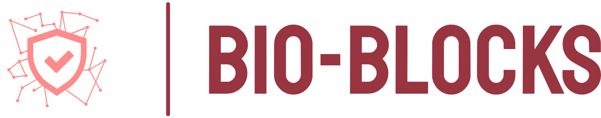

<p align="center">
    
</p>

In many applications today, managing data generation and handling can be challenging when multiple entities are involved
in a consortium, network, or project. In the biomedical context this is a pronounced problem. Maintaining a record of all data additions is crucial. Additionally, data
generated for machine learning purposes must adhere to certain criteria and standards. To address these issues, this
work proposes using a blockchain to provide a decentralized shared ledger and a deep learning model pretrained on a
binary task to filter and verify data before it is added to a new block in the blockchain. This approach can be further
developed, as outlined in the attached report.

### Code Structure

* ```./datasets``` Contains datasets for model pretraining
  * ```chest_xray``` An example dataset downloadable from [here](https://www.kaggle.com/datasets/bachrr/covid-chest-xray?resource=download)
  * ```uploaded``` Cached files from the web app uploads
* ```./models``` Models that can be used in the blockchain
* ```./out``` Output files
* ```./src``` Source files
  * ```templates``` template folder with files for the web app
  * ```app.py``` p2p implementation for the web app
  * ```blockchain.py``` blockchain implementation
  * ```model.py``` deep learning binary classifier

### Requirements
The prior requirement is conda, I suggest: [miniconda](https://docs.conda.io/en/main/miniconda.html)

### How to run
```zsh
# clone the repo
git clone https://github.com/CrisSherban/bio-blocks
cd bio-blocks

# create the environment
conda env create -f environment.yml
conda activate bio-blocks

# navigate
cd src

# run
python app.py
```

This will start the app, that currently has some CLI mandatory configs to follow.
The first is the choice of the node port, while the second is the choice of the port for the web app.

To upload a new entry navigate to: ```localhost:<port>/upload``` 
which will present the web interface to upload a new entry:
<p align="center">
    
</p>

The system is tested with x-ray chest images:
<p align="center">
    
</p>


Then to visualize the blockchain navigate to: ```localhost:<port>/get_chain``` :
<p align="center">
    
</p>

The current version does not handle automatic node updates.
To update a given node in the network type the port of the node and packets for the blockchain will be sent through UDP.


### Acknowledgements

Project for Blockchain and Cryptocurrency Course held by [Stefano Ferretti](https://scholar.google.com/citations?user=ZFPFpDwAAAAJ)